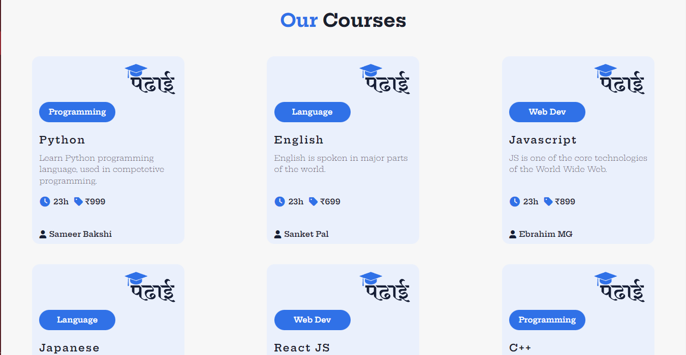
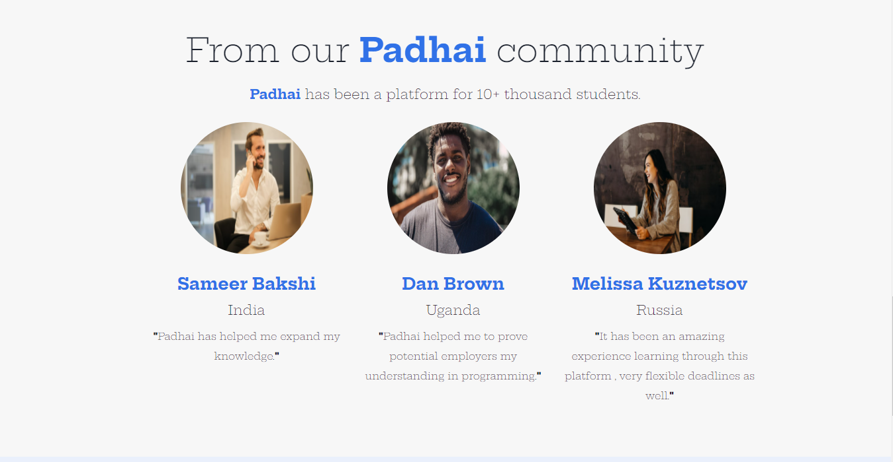
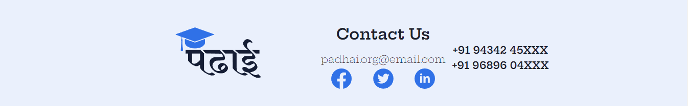

# Padhai 
<h3>Created for Thapa Technical Codefest</h3>
<h3>The Online Education Website </h3>

# Developers

[Ebrahim Ghantiwala](https://github.com/EbrG786)

[Sameer Bakshi](https://github.com/samx03)

<h2>Preview:</h2>

<h2>Technologies Used:</h2>
<ul>
<li>React</li>
<li>Chakra UI</li>
<li>React Reveal</li>
<li>And more..</li>
</ul>

<h2>How to run the project:</h2>
<ul>
<li>Clone the project locally</li>
<li>Run the <b>npm install</b> command</li>
<li>Once that is done run the <b>npm start</b> command to run the project.</li>
<li><b>Wallah the project is ready!</b></li>
</ul>
